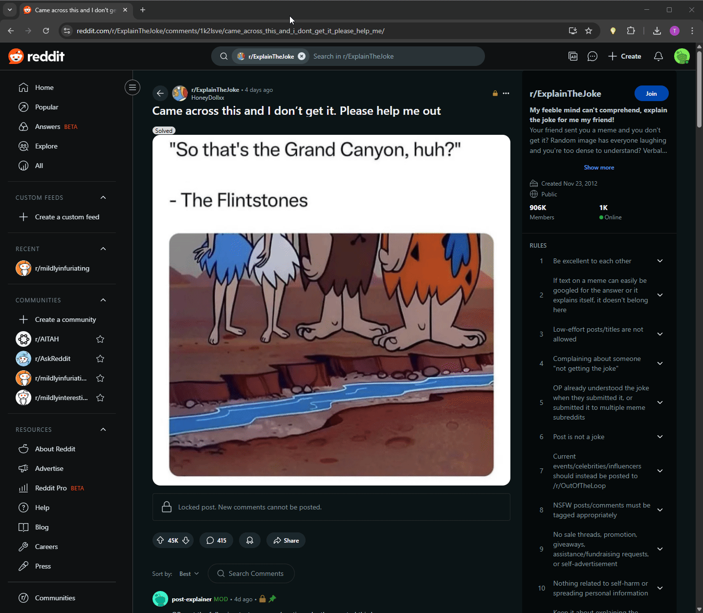
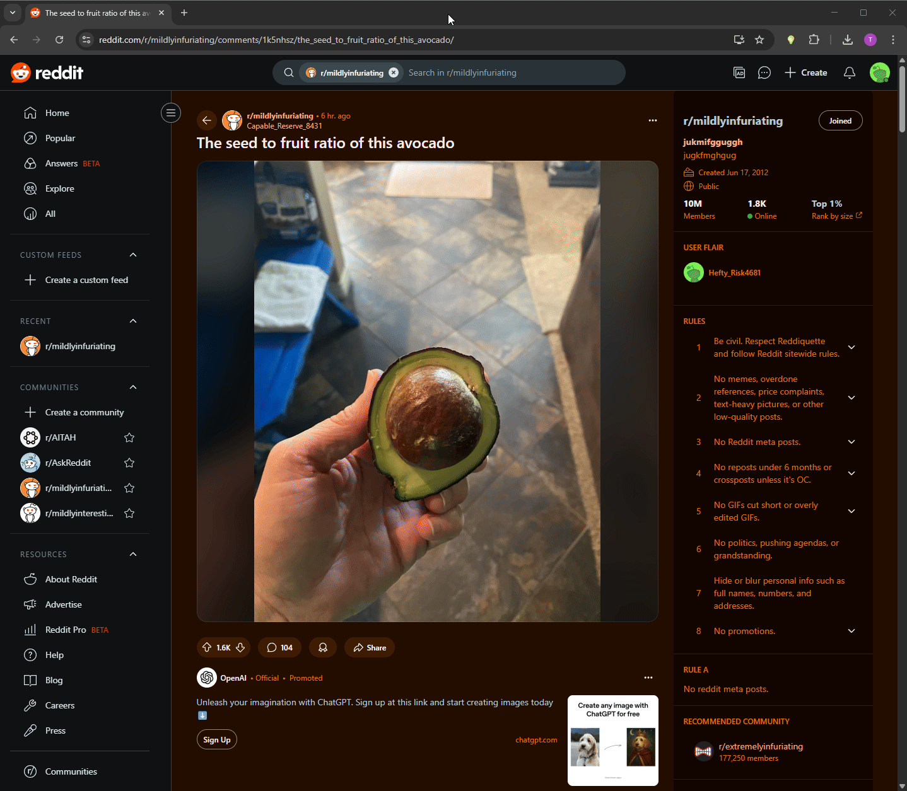

# TIPS: A TwIPS Tool

[](https://creativecommons.org/licenses/by-nc/4.0/)
[](https://github.com/andrewelawrence/TIPS/releases) 
[](https://github.com/andrewelawrence/TIPS/actions)

**TIPS is a Chromium browser extension designed to enhance online communication by providing AI-powered interpretations of text and images.**

It draws inspiration from the research concepts presented in the TwIPS messaging platform ([arXiv:2407.17760](https://arxiv.org/pdf/2407.17760)).
See the project [design document](https://docs.google.com/document/d/1nshcoPpixGUOw4tU8csQm7JQtdqcUCGqiwjO3W1fTMw/edit?usp=sharing) for more information.

## Overview

In online discussions, forums, and social media, the true meaning, tone, and context behind content can often be unclear - especially to neurodivergent users. TIPS aims to bridge this gap by offering users quick AI insights directly within their browser. By selecting text, images, or links, users can invoke AI-powered interpretation to better understand nuance, tone, and implied meaning.

## Current Status

⚠️ **Alpha - v0.6.3:** This extension is still under development. Expect bugs.

## Features

### Interpret Text
Select any text on a webpage and click the icon to "Interpret" and get AI analysis of its meaning, tone, and nuance.



### Interpret Images
Right-click on any image and select "Interpret" to analyze the visual content.



### Enhanced Understanding with Context
Add relevant page elements to context before interpreting for more accurate results.


## Technology Stack

*   **Platform:** Chrome Extension (Manifest V3)
*   **Language:** TypeScript
*   **UI (Popup):** Svelte
*   **Build Tool:** Vite
*   **AI:** Anthropic Claude API via `@anthropic-ai/sdk`
*   **Styling:** CSS (component styles in Svelte)

## Development Setup

1.  **Prerequisites:** Ensure you have [Node.js](https://nodejs.org/) and [Git](https://git-scm.com/) installed.

2.  **Clone & Navigate:**
    ```bash
    git clone https://github.com/andrewelawrence/TIPS
    cd TIPS
    ```

3.  **Install Dependencies:**
    ```bash
    # Ensure you are in the TIPS directory
    npm install
    ```

4.  **Configure API Keys:**
    *   Get an API key from [Anthropic](https://console.anthropic.com/).
    ```bash
    touch .env.local
    # Add your key to the file: `VITE_ANTHROPIC_API_KEY=YOUR_ANTHROPIC_API_KEY_HERE`
    # *(Note: `.env.local` is in `.gitignore` and should not be committed.)*
    ```
    *   **Configure Firebase Logging:**
        *   Go to the [Firebase Console](https://console.firebase.google.com/) and create a new project (or use an existing one).
        *   Add the following to your `.env.local` file:
            ```
            VITE_FIREBASE_DATABASE_URL=YOUR_FIREBASE_DATABASE_URL
            VITE_ENABLE_LOGGING=true
            ```

5.  **Build the Extension:**
    ```bash
    # Still TIPS
    npm run build
    ```
    *   This compiles the code and outputs the necessary files to the `dist/` directory at the project root.

6.  **Load in Chrome:**
    *   Open Chrome and go to `chrome://extensions/`.
    *   Enable "Developer mode".
    *   Click "Load unpacked".
    *   Select the `dist/` directory (the one created by the build process).

7.  **Usage:**
    *   The extension should now be active. Right-click elements or select text and click the 💡 icon to use TIPS.

## Architecture
```
[ Content Script (content.ts) ]        <-- User interacts with page (selection, right-click)
         | (Detects selection -> shows icon)
         | (Manages icon click -> sends INTERPRET_TEXT to background)
         | (Receives confirmation -> shows tooltip)
         |
         |-----> [ Right-Click Event ] ---> [ Background Script (background.ts) ] <-- User adds context / interprets
                     | (Context Menu Click: Interpret / Add to Context)
                     | (Info about clicked element: selectionText, srcUrl, linkUrl, pageUrl)
                     v
[ Background Service Worker (background.ts) ]
         | (Handles context menu clicks)
         | (Manages context list per tab in chrome.storage/memory)
         | (Receives INTERPRET_TEXT message OR context menu interpret click)
         | (Retrieves API key, context list)
         | (Calls Anthropic API with target + context) --> [ Anthropic API ]
         | (Parses response, stores interpretation in chrome.storage.local)
         | (Sends confirmation to content script if applicable)
         | (Handles chrome.runtime.onInstalled for welcome page)
         v
[ Popup (Popup.svelte / main.ts) ]   <-- User Clicks Toolbar Icon
         | (Loads last interpretation data from chrome.storage.local on open)
         | (Displays interpreted element, interpretation, tone, confidence)
```

## Acknowledgements

*   Inspired by the [TwIPS](https://arxiv.org/pdf/2407.17760) research paper.
*   [Tip Icon](https://icons8.com/icon/Z95XtLhDtSm6/idea) by [Icons8](https://icons8.com).

## License

This project is licensed under the Creative Commons License - see the [LICENSE](LICENSE) file for details.

_Last updated: May 04 2025_